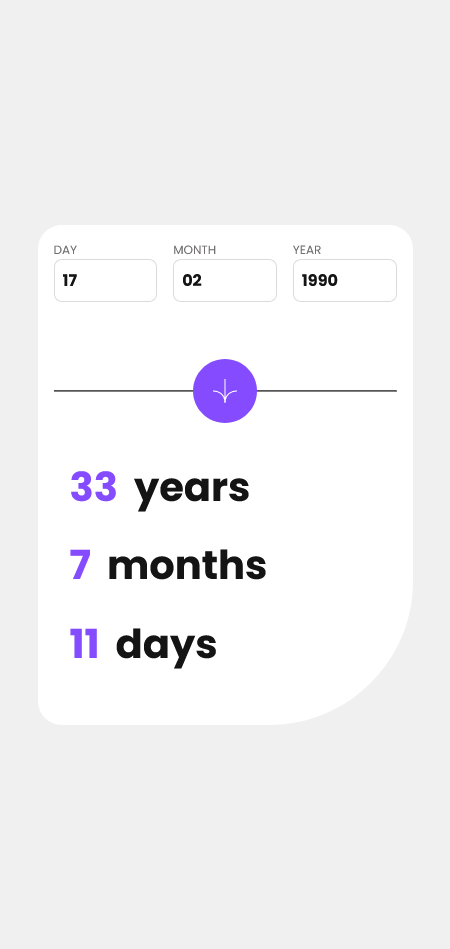
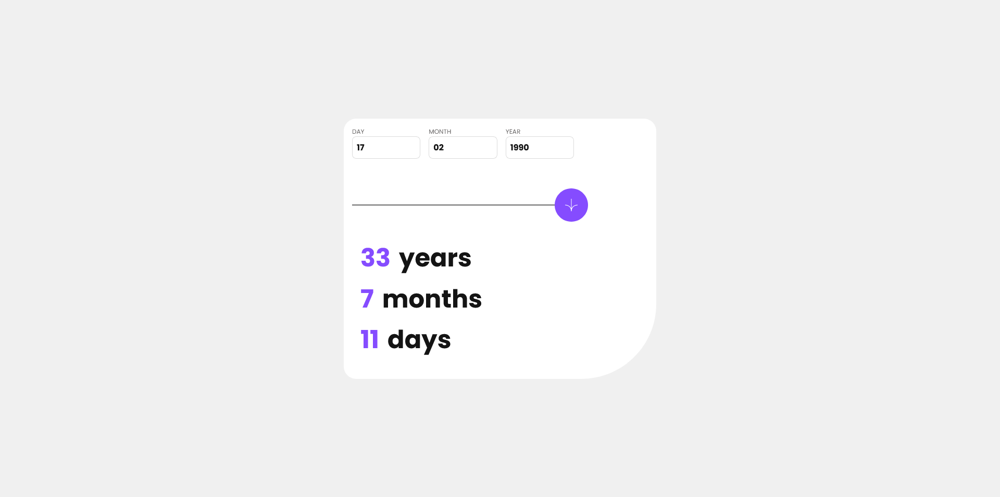

# Frontend Mentor - Age calculator app solution

This is a solution to the [Age calculator app challenge on Frontend Mentor](https://www.frontendmentor.io/challenges/age-calculator-app-dF9DFFpj-Q). Frontend Mentor challenges help you improve your coding skills by building realistic projects.

## Table of contents

- [Overview](#overview)
  - [The challenge](#the-challenge)
  - [Screenshot](#screenshot)
  - [Links](#links)
- [My process](#my-process)
  - [Built with](#built-with)

## Overview

### The challenge

Users should be able to:

- View an age in years, months, and days after submitting a valid date through the form
- Receive validation errors if:
  - Any field is empty when the form is submitted
  - The day number is not between 1-31
  - The month number is not between 1-12
  - The year is in the future
  - The date is invalid e.g. 31/04/1991 (there are 30 days in April)
- View the optimal layout for the interface depending on their device's screen size
- See hover and focus states for all interactive elements on the page
- **Bonus**: See the age numbers animate to their final number when the form is submitted

### Screenshot

### Links

- Live Site URL: [Solution](https://piojosistematico.github.io/fem-age-calculator-app/)

## My process

### Built with

- Semantic HTML5 markup
- CSS custom properties
- Mobile-first workflow
- React + Typescript

### Technologies used

    <code></code>

    <code></code>

    <code></code>

    <code></code>

    <code></code>

### React + Typescript Front-End Master Series (Junior Challenges)

If you are interested check out the other projects of the front end master challenges (Junior) that i solved with react + typescript (trying to learn both)

- [fem-age-calculator-app](https://github.com/PiojoSistematico/fem-age-calculator-app/)
- [fem-news-homepage](https://github.com/PiojoSistematico/fem-news-homepage/)
- [fem-notifications-page](https://github.com/PiojoSistematico/fem-notifications-page/)
- [fem-interactive-card-details-form](https://github.com/PiojoSistematico/fem-interactive-card-details-form/)
- [fem-expenses-chart-component](https://github.com/PiojoSistematico/fem-expenses-chart-component/)
- [fem-intro-section-with-dropdown](https://github.com/PiojoSistematico/fem-intro-section-with-dropdown/)
- [fem-advice-generator-app](https://github.com/PiojoSistematico/fem-advice-generator-app/)
- [fem-time-tracking-dashboard](https://github.com/PiojoSistematico/fem-time-tracking-dashboard/)
- [fem-tip-calculator-app](https://github.com/PiojoSistematico/fem-tip-calculator-app/)
- [fem-sunnyside-agency-landing-page](https://github.com/PiojoSistematico/fem-sunnyside-agency-landing-page/)
- [fem-blogr-landing-page](https://github.com/PiojoSistematico/fem-blogr-landing-page/)
- [fem-crowdfunding-product-page](https://github.com/PiojoSistematico/fem-crowdfunding-product-page/)
- [fem-interactive-pricing-component](https://github.com/PiojoSistematico/fem-interactive-pricing-component/)
- [fem-loopstudios-landing-page](https://github.com/PiojoSistematico/fem-loopstudios-landing-page/)
- [fem-coding-bootcamp-testimonials-slider](https://github.com/PiojoSistematico/fem-coding-bootcamp-testimonials-slider/)
- [fem-social-media-dashboard](https://github.com/PiojoSistematico/fem-social-media-dashboard/)
- [fem-insure-landing-page](https://github.com/PiojoSistematico/fem-insure-landing-page/)
- [fem-pricing-component-with-toggle](https://github.com/PiojoSistematico/fem-pricing-component-with-toggle/)
- [fem-project-tracking-intro-component](https://github.com/PiojoSistematico/fem-project-tracking-intro-component/)
- [fem-fylo-dark-theme-landing-page](https://github.com/PiojoSistematico/fem-fylo-dark-theme-landing-page/)
